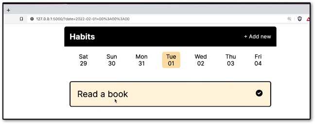

# Web Developer Bootcamp with Flask and Python in 2023

### Udemy Course Link
[Web Developer Bootcamp with Flask and Python in 2023](https://www.udemy.com/course/web-developer-bootcamp-flask-python)

## Project 2 - Habit Tracker

### Things we will learn in this project
• Make a really simple app that does something well  
• Learn how to use the date navigation  
• Learn how to implement it using query string arguments like the date  
• Learn more about forms  
• Learn how to restyle forms  
• Learn how to use hidden form fields to hide some data that the user does not need to access but is required  

We will have two MongoDB collections.  
• One for the habits  
• One for each time a habit is completed.  
• We will save something to the Database inorder to keep track of the completions separately.  

